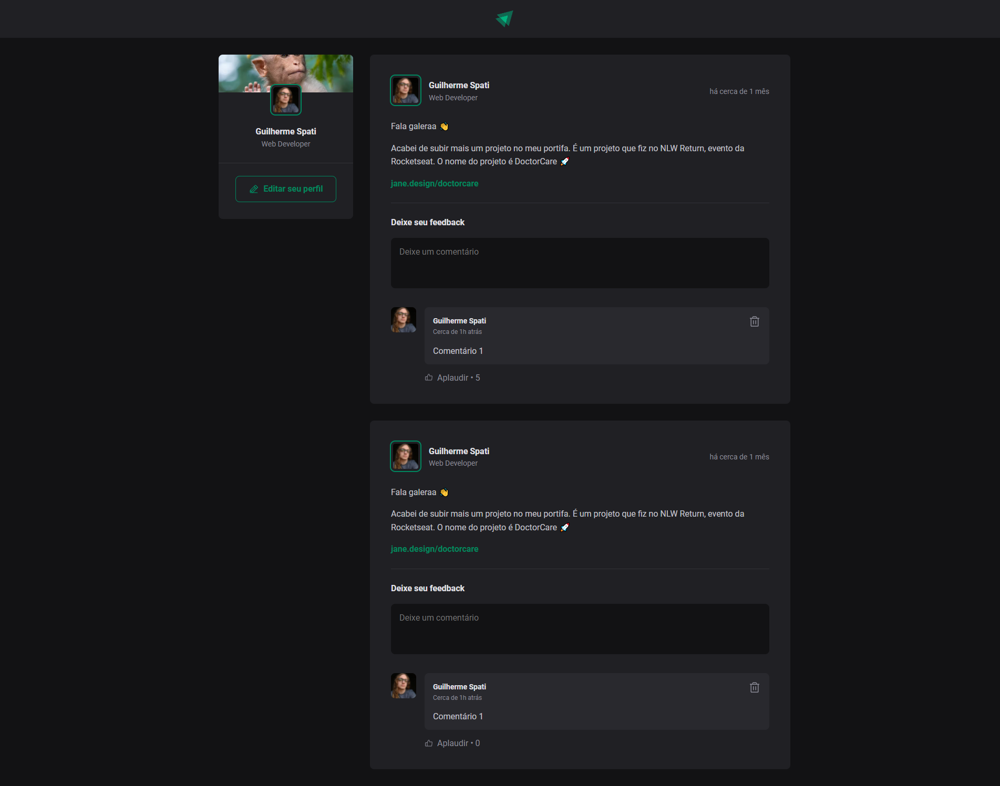

<h1 align="center">
    
</h1>

<span align="center">
    
</span>

Esse projeto é uma aplicação de um feed onde podemos fazer comentários em postagens já existentes e interagir com os comentários aplaudindo-os, além da possibilidade de fazer a exclusão dos mesmos.

## 🛠️ Construído com

Esse projeto foi desenvolvido com as seguintes tecnologias:

- [Vite](https://vitejs.dev)
- [ReactJS](https://reactjs.org)
- [TypeScript](https://www.typescriptlang.org/)

### 📋 Pré-requisitos

Para clonar e rodar essa aplicação, será necessário o [Git](https://git-scm.com) e o [Node.js](https://nodejs.org/en/) instalados no seu computador.

### 🔧 Como usar

```bash
# Clone este repositório
$ git clone https://github.com/guispati/Ignite-Feed.git

# Abra a pasta criada
$ cd Ignite-Feed

# Instale as dependências
$ npm install

# Inicie o projeto
$ npm run dev
```

## 💻 Demonstração

Na tela inicial são listados as postagens já existentes, permitindo que o usuário interaja com as mesmas fazendo um comentário ou aplaudindo os comentários já existentes, e caso não queira que aquele comentário continue ativo, é possível deletá-lo:


## 📄 Licença

Este projeto está sob a licença MIT - veja o arquivo [LICENSE.md](LICENSE.md) para mais detalhes.

---
⌨️ com ❤️ por [Guilherme Spati](https://github.com/guispati) 😊